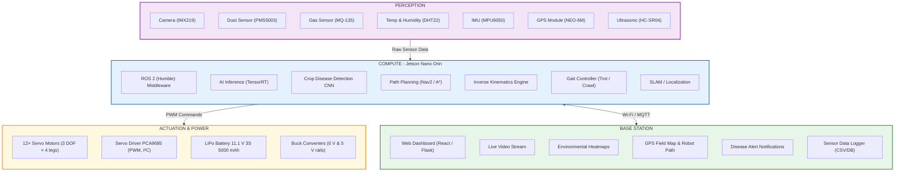

```mermaid
graph TD
    subgraph Perception ["PERCEPTION"]
        direction TB
        Cam["Camera (IMX219)"]
        Dust["Dust Sensor (PMS5003)"]
        Gas["Gas Sensor (MQ-135)"]
        Env["Temp & Humidity (DHT22)"]
        IMU["IMU (MPU6050)"]
        GPS["GPS Module (NEO-6M)"]
        Ultra["Ultrasonic (HC-SR04)"]
    end

    subgraph Compute ["COMPUTE - Jetson Nano Orin"]
        direction TB
        ROS["ROS 2 (Humble) Middleware"]
        AI["AI Inference (TensorRT)"]
        CNN["Crop Disease Detection CNN"]
        Path["Path Planning (Nav2 / A*)"]
        Kinematics["Inverse Kinematics Engine"]
        Gait["Gait Controller (Trot / Crawl)"]
        SLAM["SLAM / Localization"]
    end

    subgraph Actuation ["ACTUATION & POWER"]
        direction TB
        Servos["12× Servo Motors (3 DOF × 4 legs)"]
        Driver["Servo Driver PCA9685 (PWM, I²C)"]
        Battery["LiPo Battery 11.1 V 3S 5000 mAh"]
        Regulators["Buck Converters (6 V & 5 V rails)"]
    end

    subgraph BaseStation ["BASE STATION"]
        direction TB
        Dash["Web Dashboard (React / Flask)"]
        Stream["Live Video Stream"]
        Heatmaps["Environmental Heatmaps"]
        Map["GPS Field Map & Robot Path"]
        Alerts["Disease Alert Notifications"]
        Logger["Sensor Data Logger (CSV/DB)"]
    end

    %% Connections between major blocks
    Perception -->|"Raw Sensor Data"| Compute
    Compute -->|"PWM Commands"| Actuation
    Compute <-->|"Wi-Fi / MQTT"| BaseStation

    %% Styling
    classDef perception_style fill:#F3E5F5,stroke:#7B1FA2,stroke-width:2px;
    classDef compute_style fill:#E3F2FD,stroke:#1565C0,stroke-width:2px;
    classDef actuation_style fill:#FFF8E1,stroke:#F57F17,stroke-width:2px;
    classDef station_style fill:#E8F5E9,stroke:#2E7D32,stroke-width:2px;

    class Perception perception_style;
    class Compute compute_style;
    class Actuation actuation_style;
    class BaseStation station_style;
```
